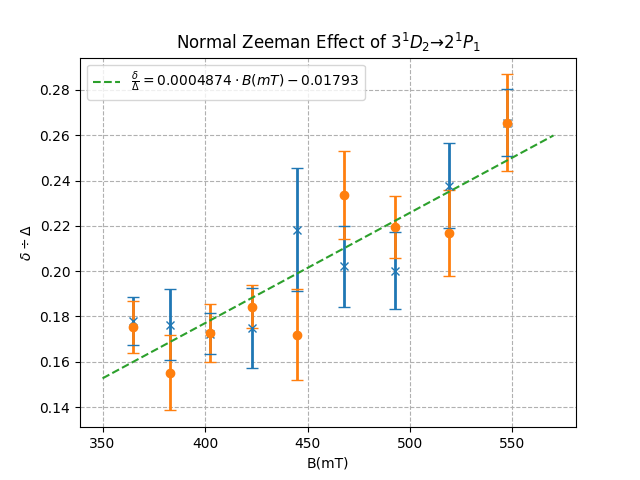
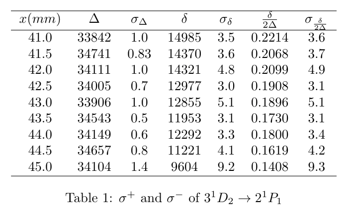
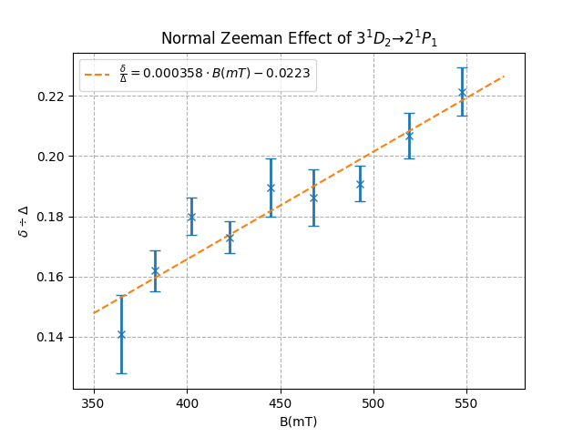
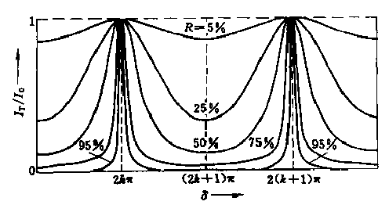

# Zeeman-Effect
##数据分析
* 我们发现使用取三点做圆的方法误差很大, 其原因有:
    1. 图像上其实不是一个完美的圆, 而是一个很接近圆的椭圆
    2. 只用三个点不能完全利用图像上的信息----不能完全利用信息也就意味着误差的增大
    
    于是我们决定亲自编写程式进行误差分析, 原计划让计算机自动识别圆并且拟合, 但是效果不好, 原因是计算机在低对比度的图像边缘的表现很差, 而图像边缘的点对于拟合数据来说是很关键的(边缘的点的 condition number 是中间的点的好几倍), 所以最后决定采用人工标记+取很多点最小二乘的策略. 我们编写了程式如 https://github.com/WhymustIhaveaname/Zeeman-Effect/anaData.py, 其有如下的优点:
    1. 具有GUI
    2. 使用椭圆进行拟合, 拟合效果更好
    3. 可以点很多冗余的点进行最小二乘
    4. 可以给出拟合的误差
    5. 在点点的同时实时显示拟合结果, 便于立即发现 fake minium 和 直观感受不同区域的点的 condition number
    6. 在左键取点后支持使用键盘上的 wasd 进行以1像素为单位的微调；并且支持使用 backspace 依次删除点.
    7. 支持使用键盘上的 c 改变颜色使点和圆更清晰
    
    下图展示了我们的程式的工作情况, 下下图示例了如果使用圆来拟合会怎样, 说明了使用椭圆拟合的必要性. 这两张图片中, 为了使点和圆更明显, 我加粗了线条, 实际工作中使用了更细的线条以达到更高的精度.
    
    
    

* 对红光, 磁场平行于光路的情况进行处理, 得到原始数据如下表所示. 其中 C1--C6 是从内到外的六个圆, $r^2$ 单位为像素的平方, $\sigma$ 为 $r^2$ 的误差. 半径使用的是长短轴的平均值, 因为我们知道, 任何的缩放比例都会被之后的数据处理消去, 所以平均长短轴以减小误差.
    
    ##### 红光, 磁场平行于光路
    |x(mm)|B(mT)|C1||C2||C3||C4||C5||C6||
    |-----|-----|-|-|-|-|-|-|-|-|-|-|-|-|
    |||$r^2$|$\sigma$|$r^2$|$\sigma$|$r^2$|$\sigma$|$r^2$|$\sigma$|$r^2$|$\sigma$|$r^2$|$\sigma$|$r^2$|
    |41.0|547.28|21838|0.79|29241|0.48|37272|1.24|55960|0.72|64273|0.31|72017|0.80|
    |41.5|519.15|21295|0.44|28433|0.39|36149|0.74|55531|0.98|63781|0.56|71310|0.76|
    |42.0|492.77|21374|0.76|28258|0.72|35306|0.61|55932|1.02|62901|0.18|70543|0.65|
    |42.5|468.02|22141|0.41|28291|0.38|34820|1.31|56216|0.72|63353|0.75|71610|0.67|
    |43.0|444.78|21934|0.27|28291|0.66|34820|0.62|55790|1.26|63303|0.96|69222|0.46|
    |43.5|422.95|22183|0.54|28322|0.84|34373|0.84|56745|0.99|62804|0.38|69183|0.32|
    |44.0|402.42|22275|0.35|28408|0.79|34015|0.46|57055|0.44|63058|0.29|69072|0.60|
    |44.5|383.10|22676|0.33|27833|0.23|33521|0.60|56952|0.56|63091|0.70|68489|0.54|
    |45.0|364.91|22728|0.19|27998|0.23|33258|0.25|56567|0.49|62747|0.40|68839|0.44|
    
* 接下来的数据处理有两种方法, 其一是利用

    $\Delta k=\frac{1}{2\mu t}(\frac{r_{p+1,a}^2}{r_{p+1,a}^2-r_{p,a}^2}-\frac{r_{p+1,b}^2}{r_{p+1,b}^2-r_{p,b}^2})$
    
    而另一种方法是利用
    
    $\Delta k=\frac{1}{2\mu t}\frac{\delta}{\Delta}$
    
    这两种方法处理得到的结果理论上是一致的, 但实际上后者误差更小. 其原因是, 由原始数据便可以看出, 本实验的误差还是很大的, 并且公式中还涉及到减法, 这会进一步加大误差, 而第二种方法利用 $r_{p+1,a}^2-r_{p,a}^2$ 的特性减小了 $\Delta$ 的误差, 误差也就小一些了. 意识到这一点后, 我们进一步改进误差处理的方法, 首先由
    
    $\Delta=average(r_{4}^2-r_{1}^2,r_{5}^2-r_{2}^2,r_{6}^2-r_{3}^2)$
    
    计算出 $\Delta$, 再由 $\delta_i=r_{i+4}^2-r_{i+3}^2$ 计算出 $\delta_1$, $\delta_2$, 之后再用 $\Delta k=\frac{1}{2\mu t}\frac{\delta}{\Delta}$ 得到波数差. 处理后的数据如下表所示. 每一个 $\sigma$ 都代表了它前面的量的误差, 单位为 percent. 其他量默认单位为像素的平方.
    
    ##### 红光, 磁场平行于光路
    |x(mm)|$\Delta$|$\sigma$|$\delta_1$|$\delta_1 \over \Delta$|$\sigma$|$\delta_2$|$\delta_2 \over \Delta$|$\sigma$|
    |-----|--------|--------|----------|-----------------------|--------|----------|-----------------------|--------|
    |41.0|31300|1.1|8313|0.2656|5.5|7744|0.2474|8.0|
    |41.5|34915|1.0|8250|0.2376|7.9|7529|0.2169|8.7|
    |42.0|34813|1.0|6969|0.2002|8.5|7642|0.2195|6.3|
    |42.5|35309|1.1|7137|0.2021|8.8|8257|0.2338|8.3|
    |43.0|34423|1.1|7513|0.2183|12.4|5919|0.1719|11.7|
    |43.5|34618|0.9|6059|0.1750|10.1|6379|0.1843|5.2|
    |44.0|34829|0.7|6003|0.1724|5.3|6014|0.1727|7.5|
    |44.5|34814|0.7|6139|0.1763|8.9|5398|0.1551|10.7|
    |45.0|34723|0.5|6179|0.1780|6.0|6092|0.1754|6.5|
    
* 将上述数据做图后如下图所示

    
   
* 对磁场垂直于光路的情况进行类似的分析可以得到. 其中 $\sigma$ 的单位仍旧为 percent.
    
    ```latex
    \begin{tabular}{ccccccc}
    \hline
    $x(mm)$&\Delta$&$\sigma_\Delta$&$\delta$&$\sigma_\delta$&$\frac{\delta}{2\Delta}$&$\sigma_{\frac{\delta}{2\Delta}}$\\
    \hline
    41.0&33842&1.0&14985&3.5&0.2214&3.6\\
    41.5&34741&0.83&14370&3.6&0.2068&3.7\\
    42.0&34111& 1.0& 14321& 4.8& 0.2099& 4.9\\
    42.5&34005& 0.7& 12977& 3.0& 0.1908& 3.1\\
    43.0&33906& 1.0& 12855& 5.1& 0.1896& 5.1\\
    43.5&34543& 0.5& 11953& 3.1& 0.1730& 3.1\\
    44.0&34149& 0.6& 12292& 3.3& 0.1800& 3.4\\
    44.5&34657& 0.8& 11221& 4.1& 0.1619& 4.2\\
    45.0&34104& 1.4& 9604& 9.2& 0.1408& 9.3\\
    \hline
    \end{tabular}
    ```
    
    

* 将上述数据做图得到

    
    
* 结合上述两组实验数据, 根据
  
  $\mu_B=hc\frac{\Delta k}{B}=\frac{hc}{2\mu t}\frac{\delta}{\Delta B}$
     
  并且带入 $\mu_{644nm}=1.4560$ 和 $t=3mm$ 得到
  
  $\mu_B=0.961\times10^{-24}$
  
  与标准值 $\mu_{B0}=0.927\times10^{-24}$ 比较可知相对误差为
  
  $\frac{\mu_B-\mu_{B0}}{\mu_{B0}}=3.6\%$
  
* 问题二: 請說明四分之一波長的波片在本實驗的意義.

  答: 当磁场平行于光路时, $\sigma^{+}$ 和 $\sigma^{-}$ 跃迁的谱线是方向相反的圆偏振光, 为了检验这一点, 需要用四分之一波片将圆偏振光变为相互正交的线偏振光再用偏振片加以检验.
  
* 问题三: 請說明Fabry-Perot etalon的運作原理.

  答: Fabry-Perot 干涉仪利用干涉的原理使得光形成等倾干涉的条纹, 其相对于三棱镜和光栅的优点是, 由于他的腔很厚, 所以其分辨能力远超其他分光仪器, 所以被应用于本实验分辨其他分光仪器不能分辨的微小波长差. 具体而言, FP 干涉仪的透射光强公式为
  
  $I_T=\frac{I_0}{1+\frac{4R}{(1-R)^2}\sin^2(\frac{\delta}{2})}$
  
  其中 $R$ 为 FP 腔体的反射率, 而
  
  $\delta=\frac{2\pi}{\lambda}2nh\cos\theta$
  
  由上式可知, FP 干涉仪在 $R$ 接近1, 腔体很厚时, 干涉谱线是极其锐利的, 直观而言有下图
  
  
  
  FP 干涉仪的分辨本领为
  
  $\Delta\lambda=\frac{\lambda^2}{2\pi nh}\frac{1-R}{\sqrt{R}}$
  
  对于我们的实验仪器来说, 大约为 $0.002nm$, 所以可以分辨大约为 $0.02nm$ 的塞曼分裂. 极高的分辨本领是有代价的, FP 干涉仪的量程极小, 所以实验中要加上滤光片, 如果不加滤光片, 各波长光谱的条纹会混合在一起无法测量.
  
  Fabry-Perot 干涉仪要求两个表面完全平行, 这在工程上是很困难的. 激光的谐振腔也相当于一个 Fabry-Perot 干涉仪. 
